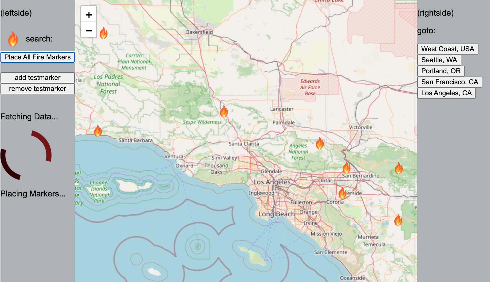
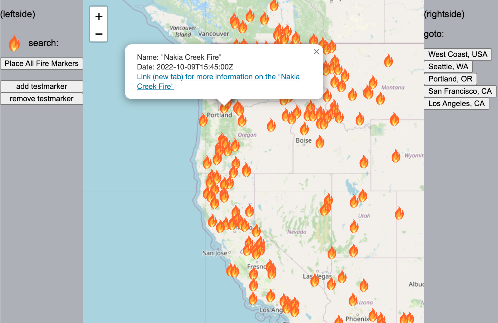

# West Coast Fire Map

- Display location, name, links to more info for active and recent wildfires.
- Real-time air quality index (AQI) information now available.
- Preset focus: Seattle, Portland, San Francisco, Los Angeles, Beijing, London, Paris.
- Currently in development

## Live Link:
https://xnd0.github.io/westcoast-firemap/

## Screenshots:

## Tools:
JavaScript, CSS3, HTML5, Leaflet, NASA wildfire API
